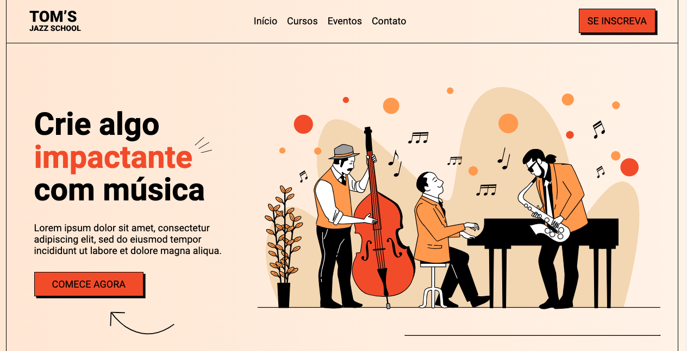

# 💻 #ONEBITCODE - Landing Page

[🚀 Acesse aqui](https://queirozlanding.vercel.app/)

## 💻 O Evento (LANDING PAGE)

Nessa série eu criei um site completo do zero, passando pelo desenvolvimento do site na versão web e também na versão Mobile.

## 🎨 Layout do projeto

Este é o <a href="https://www.figma.com/file/76GJ4uK7PyKeAo6dcpVyjA/Tom's-Jazz-School?node-id=0%3A1">layout do projeto</a> no Figma.

## 🛠 Tecnologias

- HTML
- CSS
- Figma
- Git
- GitHub

<table>
  <tr>
    <td>
     
    </td>
    <td>
      Feito por Gleidson Queiroz.</a> 🙋🏼‍♂️
    </td>
  </tr>
</table>
